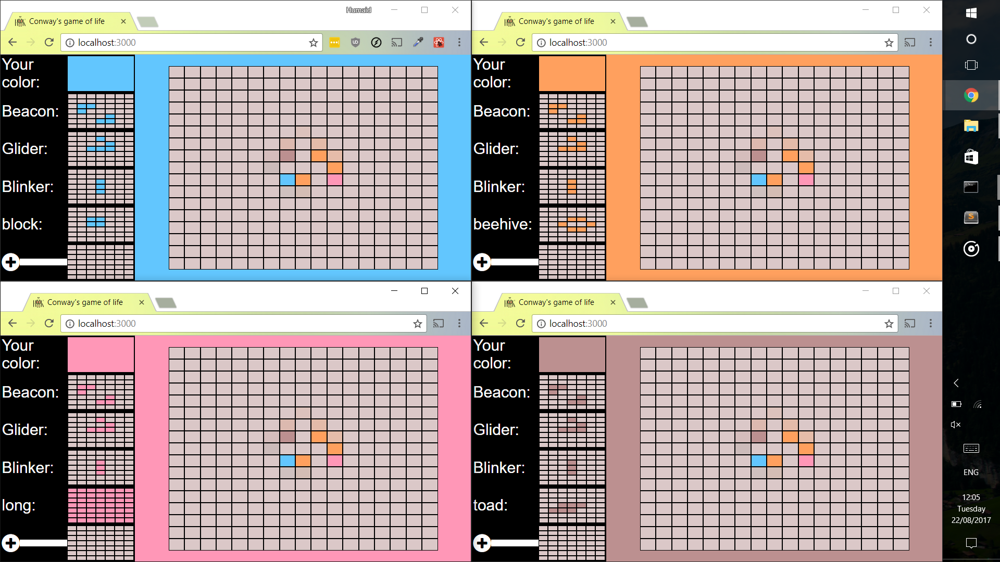

T1-Conway
==========================

Connecting user's together with a simple version of Conway's game of life(https://en.wikipedia.org/wiki/Conway%27s_Game_of_Life).

Problem
-----
Implement the game of life in a browser
  * Let Life run at a predefined interval
  * Connect users to a single synchronized world view.
  * Assign user a random color and allow users to add cells to world map with assigned color
  * Revived cells take the average color of surrounding living cells
  * Add toolbar that places Life patterns on random locations with user's color.
Extra
  * Allow users to design and add their own Life patterns.
  * Add my links to page

Solution
-----
  * Built a node/express server that polled map every 1.5 seconds after applying game of life rules
  * Used socket.io to emit 17x17 array of booleans to every connected client after each poll
  * Built front-end using React to create map that emits cell location when clicked and updates map when the socket emits a new map 
  * Styled using Flexbox and CSS principles
  * Converted boolean map to also take a color string for each cell and assigned color in client within constructor
  * Created a sidebar component with 3 6x6 default patterns that display emit newmap with selected pattern
  * Added new component to sidebar that allows creation of new patterns
  8 Developed a footer component and added my project/account links with font-awesome links
  * Deployed to heroku

Live
-----

**[This project is live!](https://serene-island-83350.herokuapp.com/)

To use application
  * Clone this repo
  * Run `npm install`
  * Run `npm start`

# Technical Choices
T1-Conway uses the following libraries:

  * [React](https://facebook.github.io/react/) - A Javascript library for building user interfaces.
  * [Express](http://expressjs.com/) - Fast, unopinionated, minimalist web framework for Node.js
  * [NodeJS](https://nodejs.org/) - Node.js uses an event-driven, non-blocking I/O model that makes it lightweight and efficient.
  * [Socket.IO](http://socket.io/) - Enables real-time bidirectional event-based communication.

# Future additions

  * Test with jest
  * Add load balancer for scalability
  * End to end Tests with nightmare or nightwatch
  * Add multiple socket rooms with each room on a different server for scalabiliy and better performance

# Other projects

  * [VrPacman](https://vrpacman.com) ([Git](https://github.com/humaidk2/vrpacman)) FPS VR version of the classic game, Pac-man
  * [Portfolio](https://humaidkhan.com) Portfolio of Humaid Khan